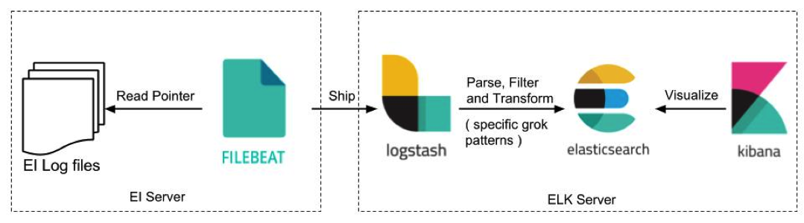

# [The ELK stack](https://www.elastic.co/elk-stack)

"ELK" is the acronym for three open source projects: Elasticsearch, Logstash, and Kibana. Elasticsearch is a search and analytics engine. Logstash is a server‑side data processing pipeline that ingests data from multiple sources simultaneously, transforms it, and then sends it to a "stash" like Elasticsearch. Kibana lets users visualize data with charts and graphs in Elasticsearch.

https://www.elastic.co/products/

## [Elasticsearch](https://www.elastic.co/products/elasticsearch)

Elasticsearch is a distributed, RESTful search and analytics engine capable of solving a growing number of use cases

http://localhost:9200/_cat/indices?v

## [Beats](https://www.elastic.co/products/beats)

Family of lightweight data shippers. 
- Filebeat - log
- Metricbeat - metrics
- Packetbeat - network data
- Winlogbeat - windows log 
- Auditbeat - audit data
- Heartbeat - Uptime monitoring
- Functionbeat - serverless shipper

Extensible. [Community beats](https://www.elastic.co/guide/en/beats/libbeat/current/community-beats.html)

## [Logstash](https://www.elastic.co/guide/en/logstash/current/index.html)

The Logstash event processing pipeline has three stages: inputs → filters → outputs. Inputs generate events, filters modify them, and outputs ship them elsewhere

Inputs: 
- file
- syslog (port 514)
- redis
- beats
- [...](https://www.elastic.co/guide/en/logstash/current/input-plugins.html)

Filters:
- grok
- mutate - rename, remove, replace, modify fields
- drop - drop event
- clone
- geoip - add geolocation info
- [...](https://www.elastic.co/guide/en/logstash/current/filter-plugins.html)

Outputs:
- elasticsearch
- file
- graphite
- statsd
- [...](https://www.elastic.co/guide/en/logstash/current/output-plugins.html)

Codecs:  
   (easily separate the transport of your messages from the serialization process):
- json
- multiline
- [...](https://www.elastic.co/guide/en/logstash/current/codec-plugins.html)

[logstash.yml](https://www.elastic.co/guide/en/logstash/current/logstash-settings-file.html)

## Kibana

