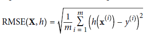
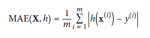

## Performance measure  

 * ### Standard deviation  

    * RMSE (Root Mean Square Error) 
	  
	  * gaussian distribution: about 68% of values are in range, 95% in (2 x range)  
	  * Euclidian norm
	     
    * MAE (Mean Absolute Error)
      
	  * Manhattan norm

	  *The higher the norm index, the more it focuses on large values and neglects small ones. This is why the RMSE is more sensitive to outliers than the MAE. But when outliers are exponentially rare (like in a bell-shaped curve), the RMSE performs very well and is generally preferred.*